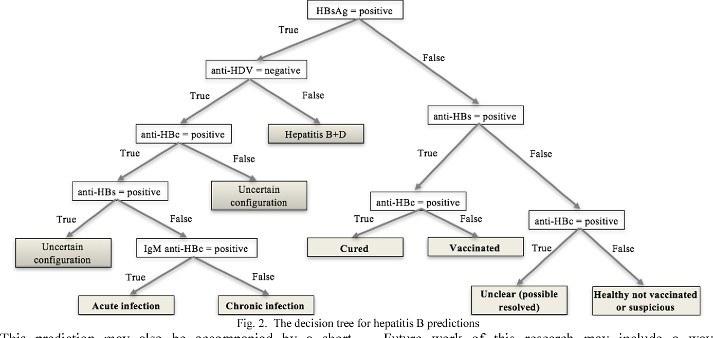
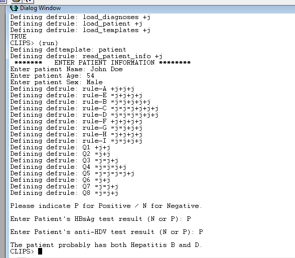

# Medical Expert System
Medical Expert System to Predict Hepatitis Infection Status created in Clips 

## Team Members
<li>LEAH LIGARE	- P15/129182/2018 </li>
<li>SHILOLI RONALD ONAMI - P15/130332/2018 </li>
<li>KIMANI HUBERT - P15/101765/2017</li>
<li>NDEGWA JENNIFER WANJIRU - P15/31661/2011 </li>
 

## How to Run
<ol>
<li> Open the Project Folder </li>
<li> Click the CLIPSIDE64.EXE and open the application </li>
<li> Go to `File` > `Load` > `Project folder` > `expert_system.clp` </li>
<li> Go to `Execution` > `Run` </li>
<li> Interact with the program</li>
</ol>

## Decision Graph
The Expert system follows the following decision graph (found online):   

  

## Sample Output
Sample output from the Expert System

